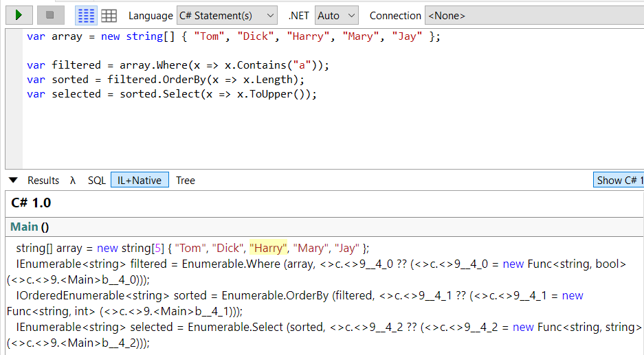

- LINQ - language integrated query
- LINQ появился в C# 3.0 и .NET Framework 3.5
- позволяет создавать запросы к любой коллекции, которая реализует интерфейс IEnumerable`<T>`
- пространства имен: System.Linq и System.Linq.Expression

Преимущества:

- проверка типов на этапе компиляции
- формирование динамических запросов

# Начало работы

- есть последовательность и элементы
- последовательность - объект, который реализует IEnumerable`<T>`
- элемент - единица данных внутри последовательности

Операция запроса - метод, который трансформирует последовательность.

Пример: простой пример операции запроса принимает `входную последовательность` и выдает тронсформированную `выходную последовательность`.

В классе Enumerable из простанства имен System.Linq имеется около 40 операций запросов - все они реализованы в виде статических методов.

Запрос - выражение, которое при перечислении трансформирует последовательности с помощью операций запросов

Пример запроса в разных видах

```csharp
var array = new string[] { "Tom", "Dick", "Harry" };

var result1 = System.Linq.Enumerable.Where(array, x => x.Length >= 4);
var result2 = array.Where(x => x.Length >= 4);
```

Большинство операций запросов принимают лямбда-выражение. Лямбда-выражение помогает направлять и формировать запрос.

Синтаксис через операции запросов хорошо компануема в том смысле, что позволяет формировать цепочки операций запросов.

В C# для написания запросов есть и другой синтаксис - выражение запросов.

```csharp
var array = new string[] { "Tom", "Dick", "Harry" };

var result3 = from x in array
              where x.Length >= 4
              select x;
```


# Операции запроса

Вопрос: в чем важность расширяющих методов?

Вместо расширяющих методов, можно использовать статические методы. Пример ниже.

Именно так компилятор транслирует вызовы расширяющих методов (см. скрины ниже).

В итоге, с применением расширяющих методов, его линейная форма удобна в читании запроса слева-направо, без этого получается белеберда.

```csharp
var array = new string[] { "Tom", "Dick", "Harry" };

var result1 = System.Linq.Enumerable.Where(array, x => x.Length >= 4);
```

## Выстраивание в цепочки операций запросов

```csharp
var array = new string[] { "Tom", "Dick", "Harry", "Mary", "Jay" };

var result = array
    .Where(x => x.Contains("a"))
    .OrderBy(x => x.Length)
    .Select(x => x.ToUpper());
```


- операции запроса никогда не изменяют входную последовательность, взамен они возвращают новую последовательность.

Когда операции запросов выстариваются в цепочку, выходная последовательность одной операции является входной последовательностью следующей операции.


Запрос выше, можно строить постепенно.

```csharp
var array = new string[] { "Tom", "Dick", "Harry", "Mary", "Jay" };

var filtered = array.Where(x => x.Contains("a"));
var sorted = filtered.OrderBy(x => x.Length);
var selected = sorted.Select(x => x.ToUpper());
```



# Выражения запросов

В C# для написания запросов есть и другой синтаксис - выражение запросов.

```csharp
var array = new string[] { "Tom", "Dick", "Harry" };

var result3 = from x in array
              where x.Length >= 4
              select x;
```


- всегда начинается с from и заканчивается либо select, либо group
- компилятор обрабатывает выражение запросов, транслируюя их в fluent синтаксис
- любое выражение запросов можно переписать на fluent синтаксис

## Сравнение синтаксиса запросов и fluent синтаксиса

Преимущества выражения запросов:

- конструкция let - для введения новой переменной
- операции SelectMany, Join, GroupJoin

Для запросов, состоящих из одной операции, fluent синтаксис короче.

- два синтаксиса можно смешивать

# Отложенное выполенние

- важная особенность большинства запросов в том, что они выполняются тогда, когда происходит перечисление, а не когда создаются

```csharp
var list = new List<int> { 1, 2, 3 };

var result = list.Where(x => x >= 2); // построение запроса

list.Add(4); // доп. число, вставленное в список после построения запроса, включается в результат
list.Add(5);

// Result: 2, 3, 4, 5

foreach (var item in result) { // выполнение запроса
    Console.WriteLine(item);
}
```

Пример выше называется `отложенным` или `ленивым` выполнением.

Но отложенное выполнение имеет исключения:

- операции, которые возвращают один элемент или скалярное значение (First, Count)
- операции преобразования (ToArray, ToList, ...)
- при повторном перечислении запрос оценивается заново

```csharp
// повторная оценка

// повторную оценку можно избежать выполнив приведение: ToArray, ToList, ...

var list = new List<int> { 1, 2, 3 };

var result = list.Where(x => x >= 2);

list.Add(4);
list.Add(5);

foreach (var item in result)
{
    Console.WriteLine(item);
}

list.Clear();

foreach (var item in result)
{
    Console.WriteLine(item);
}

// Result: 2, 3, 4, 5 and then (empty)
```

Эти исключения вызывают немедленное выполнение запроса.

```csharp
var list = new List<int> { 1, 2, 3 };

var result = list.Count(x => x >= 2);

list.Add(4);
list.Add(5);

// Result: 2
```

## Захваченные переменные

- лямбда-выражение захватывает `внешние` переменные

```csharp
var list = new List<int> { 1, 2, 3 };

var number = 20;

var result = list.Select(x => x * number);

foreach (var item in result)
{
    Console.WriteLine(item);
}

// Result: 20, 40, 60
```

## Как работает отложенное выполнение

Операции запроса обеспечивают отложенное выполнение за счет возвращение `декораторных` последовательностей.

Декоратор - это функция, которая позволяет обернуть другую функцию для расширения её функциональности без непосредственного изменения её кода.

Декоратор - оболочка для последовательности, которая имеет с ней постоянную зависимость.

Каждый раз, когда данные запрашиваются из декоратора, он в свою очередь должен запрашивать данные из внутренней входной последовательности.


При перечислении lessThanTen в действительности происходит запрос массива
через декоратор Where.

## Построение цепочки декораторов

Когда у нас цепочка запросов это создание иерархических декораторов.

```csharp
var query = new int[] { 5, 12, 3 }
    .Where(x => x < 10)
    .OrderBy(x => x)
    .Select(x => x * 10);
```

Каждая операция создает новый экземляр декоратора, который является оболочкой для предыдущей последовательности.


## Каким образам выполняются запросы

```csharp
var query = new int[] { 5, 12, 3 }
    .Where(x => x < 10)
    .OrderBy(x => x)
    .Select(x => x * 10);

foreach (var item in query)
{
    Console.WriteLine(item);
}

// Result: 30, 50
```

## Подзапросы

- запрос, содержащийся внутри лямбда-выражения другого запроса

```csharp
var musos = new string[] { "David Gilmour", "Roger Waters", "Rick Wright", "Nick Mason" };

var query = musos
    .OrderBy(m => m.Split().Last()); // подзапрос
```

- подзапрос выполняется каждый раз, когда вычисляется включающее его лямбда-выражение (то есть выполняется по требованию, на усмотрение внешнего запроса)
- подзапрос выполняется, когда это требуется для передачи данных внешнему запросу

```csharp
// Пример: извлекает из массива самые короткие строки

// Этот запрос идеален для запроса к БД, т.к. он может быть обработан как единое целое
// Этот запрос неэффективен для локальной коллекции, т.к. на каждой итерации внешнего цикла, подзапрос будет вычисляться повторно

// Неэффективность можно избежать, запустив подзапрос отдельно

var names = new string[] { "Tom", "Dick", "Harry", "Mary", "Jay" };

var query = names
    .Where(n => n.Length == names
        .OrderBy(n2 => n2.Length)
        .Select(n2 => n2.Length)
        .First()
    );

var query = names
    .Where(n => n.Length == names.Min(n => n.Length));
```

```csharp
// Пример: как избежать неэффективность

var names = new string[] { "Tom", "Dick", "Harry", "Mary", "Jay" };

var shortest = names.Min(n => n.Length);

var query = names
    .Where(n => n.Length == shortest);

```

## Подзапросы и отложенное выполнение

- наличие в подзапросе операций First или Count, не приводит к немедленному выполнению внешнего запроса (внешний запрос по-прежнему поддерживает отложенное выполнение)

Причина в том, что подзапросы вызываются косвенно.

# Стратегии композиции

1. постепенное построение запросов
2. использование кл. слова into
3. упаковка запросов

## Постепенное построение запросов

Запрос можно построить постепенно. Это можно переписать в одну цепочку.

```csharp
var filtered = names.Where(n => n.Contains ("a"));
var sorted = filtered.OrderBy(n => n);
var query = sorted.Select(n => n.ToUpper());
```

Ряд преимуществ:

- упрощение написание запроса
- операции запросов можно добавлять условно

```csharp
if (includeFilter) {
    query = query.Where (...)
}

// Неэффективный пример
// query = query.Where (n => ! includeFilter | | <выражение>)
```

## Ключевое слово into

- сигнализация о продолжении запроса
- позволяет продолжить запрос после проецирования
- единственное место применения после select и group
- кл. слово `начинает заново` запрос, позволяя вводить новый конструкции where, orderby, select

```csharp
var names = new string[] { "Tom", "Dick", "Harry", "Mary", "Jay" };

var query = from n in names
            select n.Replace("a", "").Replace("e", "").Replace("i", "")
                    .Replace("o", "").Replace("u", "")
            into noVowel
            orderby noVowel
            select noVowel;
```

Эквивалентом `into` в текучем синтаксисе является просто более длинная цепочка
операций.

### Правила области видимости

После кл. слова into все переменные диапазона выходят из области видимости

```csharp
var query = from nl in names
            select nl.ToUpper()
                into n2 // Начиная с этого места, видна только переменная п2
                    where nl.Contains ("x") // Недопустимо: nl не находится в области видимости
                    select п2;
```

## Упаковка запросов

# Cтратегии проекции

## Инициализаторы объектов
## Анонимные типы
## Ключевое слово let

# Интерпретируемые запросы

